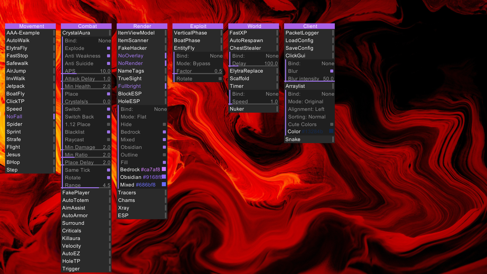

# sudo client

an old minecraft hacked client for fabric 1.19 that i made when i was younger, mostly just to learn how this sort of thing worked.
it was meant to be used on anarchy servers (servers that allow cheating), so it doesn't contain any anticheat bypasses or anything like that. 
 
it was supposed to stay private, but the other guy working on it leaked it, so might as well open source it now.  
it's rough and outdated, so you probably shouldn't use it, but feel free to poke around. 
 
there were a lot of modules (at least 70), so you might have a bit of fun exploring it.

  
the gui:

also there's a video
